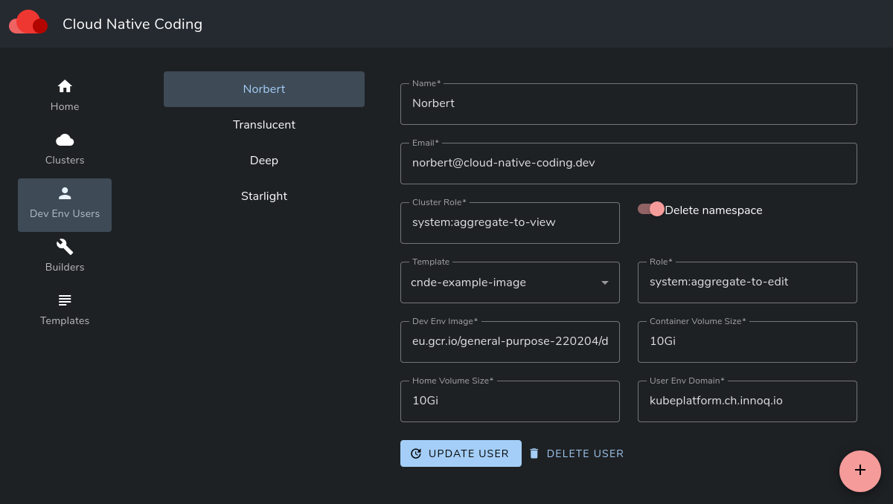
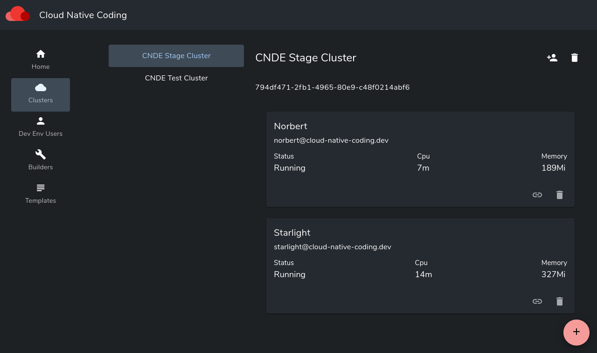

# c-n-d-e Dashboard

This is the Dashboard repository for Cloud Native Coding. It provides a configuration dashboard for clusters and their running IDEs.

For more information refer to [Cloud Native Coding](https://cloud-native-coding.dev/)

Components of this Dashboard:

- Restful API (rest-api)
- Web-application for IDE management (webapp)
- PostgreSQL for persistence

## IDEs for users

The following screen configures the available IDEs for user Norbert, Translucent etc.

The configuration manages:

- Kubernetes ClusterRole and Role
- the Container Image to use or build a dedicated image if using GitOps-Templates
- Volume size for Home and Docker volumes

## Cluster Mapping

The following maps IDEs to Cluster

## Installation

Prerequisites:

- a running Keycloak instance for User Management
- NGINX Ingress

Installation:

- configure the PostgreSQL password in both kustomization.yaml files
- deploy PostgreSQL with `kubectl -k .` in folder `postgresql`
- configure `oauth-proxy.yaml` with the proper settings for Keycloak and DNS
- configure both `ingress....yaml` files with the right domains
- deploy api and webapp with `kubectl -k .` in folder `config`
